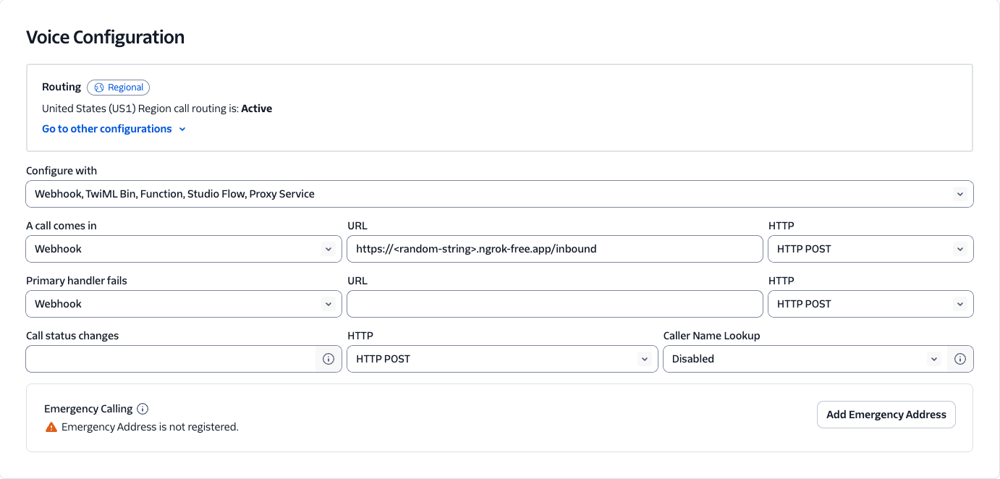

To tunnel between Twilio and your localhost using ngrok, do the following:
1. Follow the ngrok setup instructions [here](https://dashboard.ngrok.com/get-started/setup/macos).
2. Use port 3000 in the final command:
```bash
ngrok http 3000
```
You should see a line like this:
```bash
https://<your_ngrok_url>.ngrok-free.app -> http://localhost:3000
```
3. Purchase a phone number from Twilio following the instructions
[here](https://help.twilio.com/articles/223135247-How-to-Search-for-and-Buy-a-Twilio-Phone-Number-from-Console).
Navigate to Develop &#8594; Phone Numbers &#8594; Manage &#8594; Active Numbers and configure your new phone number to
send incoming calls to your ngrok URL like so:

